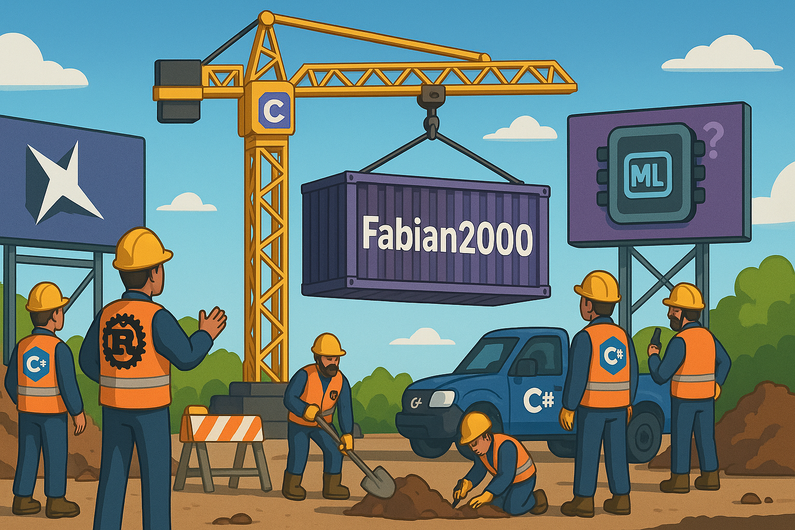

# Hello World, Hello Fabian! 👋

## 👨‍💻 About Me

I'm a software developer with expertise in C# and Rust and others, working on a diverse range of projects from desktop applications and utilities to programming languages and system-level software.

## 🔧 Technical Focus

- **Primary Languages**: C#, Rust
- **Framework Ecosystem**: .NET and cross-platform technologies
- **Areas of Interest**: Language Design, System Programming, Desktop Applications

## 🚀 Projects

- **MemoriaLang**: A programming language project in development (details coming soon)
- **FSC-Dirty/Beauty**: A user-friendly cross-platform programming language for .NET applications (discontinued)
  - FSC-Beauty: High-level language that compiles to FSC-Dirty
  - Suitable for both standalone applications and plugin development
  - Designed for easy integration into .NET applications
  - Custom extensible functionality through function definitions
  - Cross-platform support across .NET environments
- **And more**: Various other projects in desktop applications, utilities and system-level software

## 🔗 Links

- Website: [https://fabi-sc.de](https://fabi-sc.de)
- NuGet: [https://www.nuget.org/profiles/Fabian2000](https://www.nuget.org/profiles/Fabian2000)
